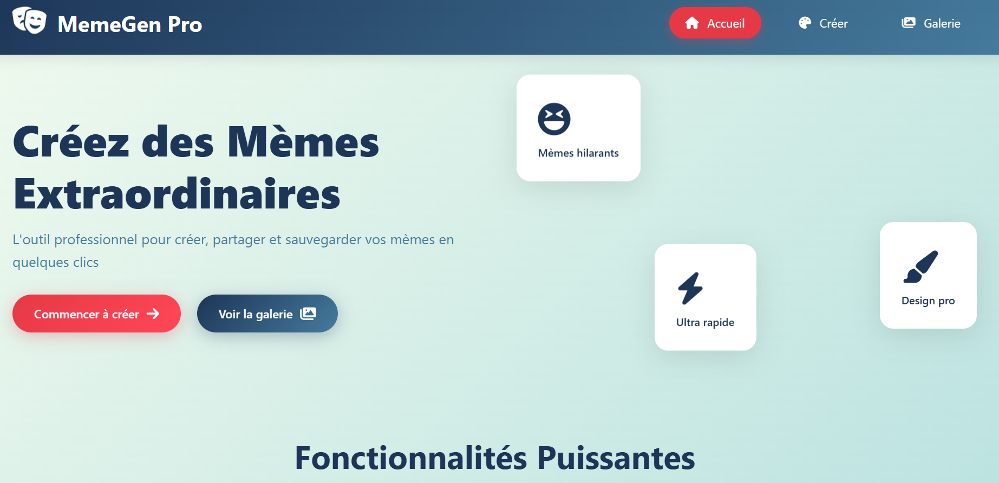
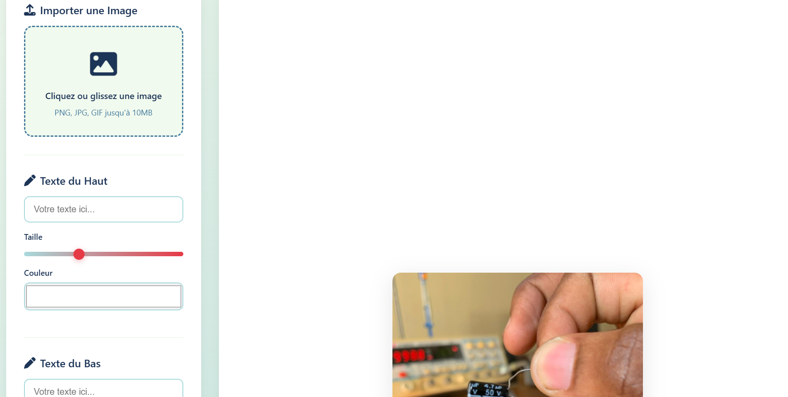
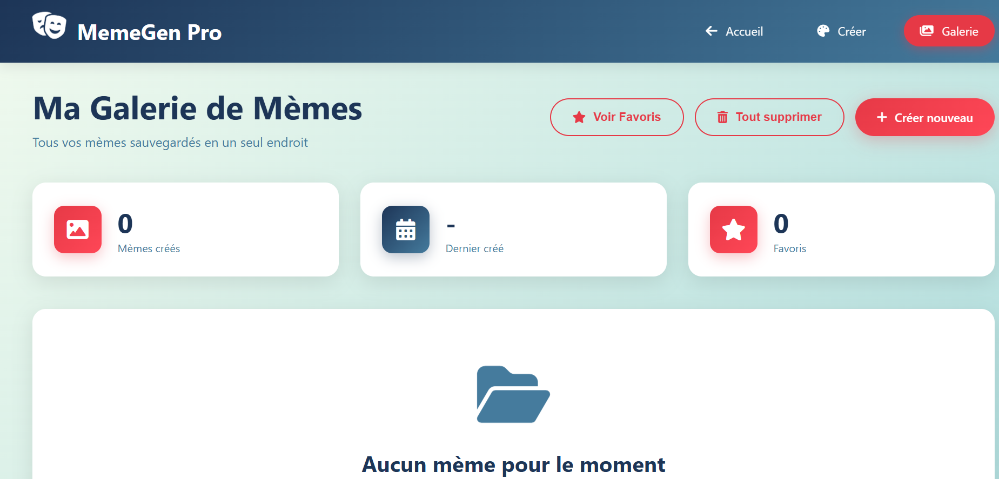

# MemeGen Pro

**Générateur de Mèmes Professionnel**  
Créez, personnalisez et partagez vos mèmes facilement avec MemeGen Pro.

## Table des matières
- [Description](#description)
- [Fonctionnalités](#fonctionnalités)
- [Technologies Utilisées](#technologies-utilisées)
- [Installation et Exécution](#installation-et-exécution)
- [Captures d'écran](#captures-décran)
- [Base de Données](#base-de-données)
- [Licence](#licence)

## Description
MemeGen Pro est une application web permettant aux utilisateurs de créer des mèmes de manière professionnelle. Elle propose un éditeur d'images complet avec texte personnalisable, aperçu en temps réel, galerie des mèmes créés et partage facile sur les réseaux sociaux.

## Fonctionnalités
- **Téléchargement d’images** : Importez vos images depuis votre ordinateur.  
- **Ajout de texte personnalisé** : Texte en haut ou en bas de l’image avec contrôles avancés (taille, couleur, ombre, déplacement).  
- **Aperçu en temps réel** : Visualisation instantanée des modifications sur l’image.  
- **Téléchargement et partage** : Exportez vos mèmes en haute qualité et partagez-les via Web Share API.  
- **Galerie des mèmes** : Consultez tous les mèmes précédemment créés.  
- **Favoris** : Marquez vos mèmes préférés pour les retrouver facilement.  

## Technologies Utilisées
- **HTML5** : Structure des pages  
- **CSS3** : Styles et animations  
- **JavaScript (Vanilla)** : Logique et interactions  
- **Canvas API** : Dessin et manipulation des mèmes  
- **localStorage** : Stockage des mèmes et statistiques (fausse base de données)  
- **Web Share API** : Partage des mèmes sur réseaux sociaux  

## Installation et Exécution

### Option 1 : Live Server (Recommandé)
1. Installez l’extension **Live Server** dans VSCode  
2. Clic droit sur `index.html`  
3. Sélectionnez **Open with Live Server**  
4. Le navigateur s’ouvre automatiquement

### Option 2 : Double-clic
1. Ouvrez le dossier du projet  
2. Double-cliquez sur `index.html`  
3. Le projet s’ouvrira dans votre navigateur par défaut

## Captures d'écran
Voici quelques captures d’écran pour illustrer l’application :

**Page d’accueil**  

**Création de mème**  

**Galerie**  

## Base de Données
- La galerie et les favoris sont stockés dans **localStorage**.  
- Les mèmes sont enregistrés sous forme d’objets JSON contenant :  
  - `id` unique  
  - `imageData` (image encodée)  
  - `topText` / `bottomText`  
  - `isFavorite`  
  - `createdAt`  
- Les statistiques (nombre de mèmes, favoris, dernier mème créé) sont également sauvegardées.

## Licence
Projet personnel – usage éducatif.  
